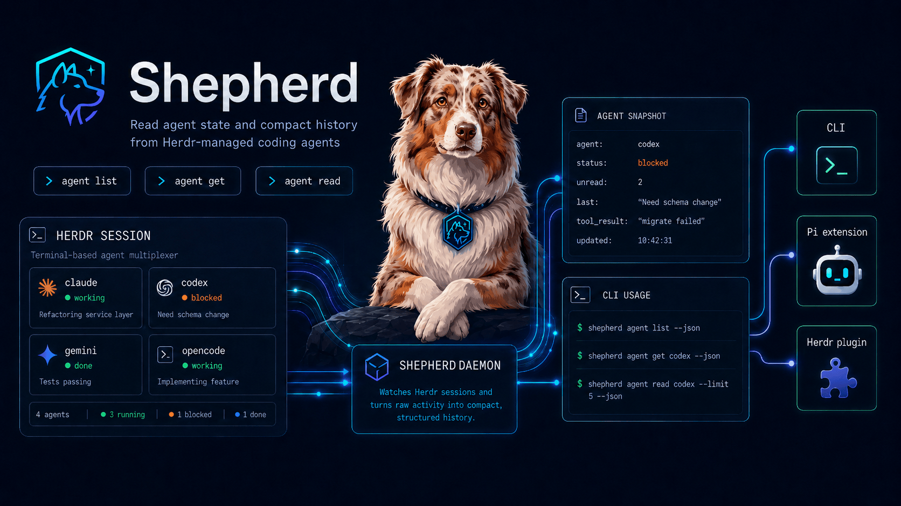

## Credits / Acknowledgements

herdsman is forked from ryonakae/herdsman at commit dfdd3a2 (v0.5.1). Thanks to the original author, Ryo Nakae, and the upstream project.

Upstream: https://github.com/ryonakae/herdsman

# Herdsman

<!-- README-I18N:START -->
**English** | [日本語](./README.ja.md)
<!-- README-I18N:END -->

Herdsman is a daemon-backed observability layer for coding agents running in Herdr. It provides two interfaces over the same durable agent index: pull-based CLI access to structured history, and owner-scoped Pi notifications with cached context and automatic wake.

Herdr's `herdr agent read` reads terminal streams or scrollback. Herdsman instead reads agent session data so callers can retrieve work status, structured message excerpts, compact tool results, and unread outcomes without parsing terminal output. Herdsman is read-only; use the official Herdr CLI or skill for agent start, prompts, waits, pane operations, and terminal control.

Herdsman currently supports session history from Claude Code, Codex, Gemini CLI, OpenCode, and Pi.

## Requirements

- Node.js >= 22.12.0
- Herdr >= 0.7.0
- Pi >= 0.80.6 when using `herdsman-pi`

## Install

```bash
npm install --global @dorokuma/herdsman
herdsman help
```

### Install from source

Source builds also require pnpm >= 11.9.0.

```bash
git clone https://github.com/dorokuma/herdsman.git
cd herdsman
pnpm install
pnpm build
npm install --global . --ignore-scripts
herdsman help
```

## Start the daemon

Herdsman agent commands and Pi notifications require the daemon. The daemon watches all running Herdr sessions reported by `herdr session list --json`, rescans them every 60 seconds, and does not index stopped Herdr sessions. Runtime files live in `~/.herdsman` by default. Set `HERDSMAN_HOME` to use another directory.

```bash
herdsman daemon start
```

## Main commands

- `herdsman agent list`: returns the daemon's latest cached status and last user / assistant excerpts for the selected workspace. Check each row's `updatedAt` when freshness matters.
- `herdsman agent get <target>`: performs an explicit detail lookup and returns one agent's metadata, compact history, and latest compact tool result.
- `herdsman agent read <target> --limit N`: performs an explicit history read and returns the latest N user / assistant / compact `tool_result` messages.

Each agent record keeps Herdr's optional live `name`, such as `reviewer`, separate from its runtime `agent` kind, such as `codex`. Human list output uses distinct `name` and `agent` columns, and JSON returns both fields. Inside a Herdr workspace, Herdsman selects the current workspace automatically.

```bash
herdsman agent list --json
herdsman agent get reviewer --json
herdsman agent read reviewer --limit 20 --json
```

From outside Herdr, pass a scope.

```bash
herdsman agent list --all --json
herdsman agent list --workspace wB --json
herdsman agent get reviewer --workspace wB --json
herdsman agent read wB:p2 --workspace wB --limit 20 --json
```

`<target>` first matches an exact pane id, terminal id, or Herdsman agent id in the selected scope. It then matches an exact Herdr live name such as `reviewer`; when no live name matches, it falls back to a unique agent kind such as `codex`. Use `--session <name>` when a target is ambiguous across running Herdr sessions.

## Agent Skill

Install the Herdsman CLI and start its daemon before adding the Agent Skill. Then add the Herdsman instructions to supported coding agents:

```bash
npx skills add dorokuma/herdsman --skill herdsman -g
```

The Herdsman skill reads structured agent status, compact history, and recent tool results. Use it alone for agent inspection.

Add the official Herdr skill when an agent needs to control workspaces, tabs, panes, terminal input/output, or waits:

```bash
npx skills add ogulcancelik/herdr --skill herdr -g
```

## Pi extension

Install the extension through Pi:

```bash
pi install npm:@dorokuma/herdsman-pi
```

The extension requires Pi 0.80.6 or newer and connects to the Herdsman daemon when Pi runs inside Herdr. Each connected Pi registers its exact Pi session path as presence identity, including while off. The extension does not send per-turn tool-result or final-message telemetry.

Enter `/herdsman on` in Pi to make this terminal the sole Herdsman owner for its current Herdr session and workspace. Only the owner receives cached current-workspace agent context, pending counts, agent updates, and automatic wake. Its context excludes its own Pi terminal and includes other Pi terminals. A normal prompt injects the locally cached snapshot without daemon RPC or history reads, so context can be temporarily absent after startup, reconnect, or scope movement until a snapshot arrives.

Completed or blocked agent outcomes start one visible Herdsman turn. If a normal user run is active, Herdsman waits for it to settle. The themed card shows up to three agents; use Pi's expand key to see every outcome and its bounded final response. Named agents appear as `reviewer · Codex`, with `Codex` as the unnamed fallback. Agent output is untrusted evidence: Pi may continue only the existing user request and must not expand its scope.

Use `/herdsman` or `/herdsman status` to inspect the current Pi, and `/herdsman off` to release owner behavior for that Pi. Turning one Pi off does not affect another owner. An off or non-owner Pi remains connected for a later claim, but receives no hidden agent context, pending counts, updates, or wake. The active Pi shows `◆ Herdsman`; pending outcomes add `· N agent updates` until a turn containing them produces a final assistant response, settles, and acknowledges every underlying event. A previously active Pi shows `◇ Herdsman · reconnecting` during transport recovery. With no owner, outcomes are not delivered, and outcomes created during the ownerless period are not replayed by a later claim. Reloads, reconnects, and direct replacement by another Pi preserve unacknowledged outcomes. Ownership follows the Herdr terminal across Pi session replacement and pane movement, and clears when that terminal remains disconnected beyond the grace period.

## Herdr plugin

Install the optional plugin from the GitHub release tag:

```bash
herdr plugin install dorokuma/herdsman/packages/herdsman-herdr-plugin --ref v0.6.0 --yes
```

The plugin connects to the Herdsman daemon and shows compact agent rows for the current Herdr workspace, including separate live-name and runtime-kind columns plus cached history excerpts. Herdr installs it from the repository subdirectory; it is not published to npm or required for the CLI and Pi extension.

## Packages

| Path | Distribution | Purpose |
| --- | --- | --- |
| repository root | npm: `@dorokuma/herdsman` | Herdsman CLI and daemon. |
| `packages/herdsman-pi` | npm: `@dorokuma/herdsman-pi` | Pi extension for agent history and agent updates. |
| `packages/herdsman-herdr-plugin` | GitHub release subdirectory | Optional Herdr UI integration; not an npm package. |

## Development

```bash
pnpm install
pnpm check
pnpm build
```

See [Releasing Herdsman](./docs/releasing.md) for package validation, npm publication, and GitHub Release steps.

DB schema changes require:

```bash
pnpm db:generate
pnpm db:check
```

## License

[MIT](./LICENSE)
